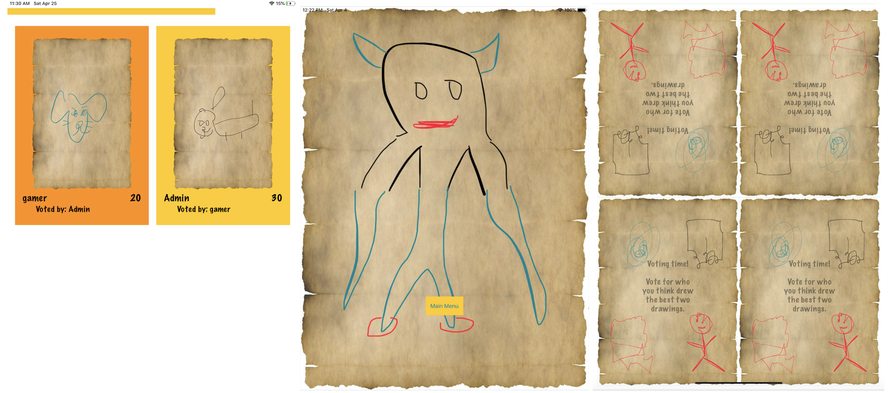

# DrawBerry

DrawBerry is a competitive multiplayer drawing game featuring 4 different exciting game modes!

DrawBerry is developed natively for iOS and allows for single-device multiplayer and multi-device multiplayer. 

## Game modes

### Classic mode
In each round, players draw according to the topic set by the round master and then vote for the drawing they think is drawn by the round master. Players gain points for tricking other players to pick their drawing and for picking the correct drawing!

Each player draws on their on device and they can choose to play in both rapid mode or non-rapid mode. In rapid mode, players' rounds are synchronized in real time and they have to draw and vote within the time limit, while in non-rapid modes, players can take their time and pause and resume the rounds as and when they like!

### Competitive mode
In each round, all 4 players draw on corner of the same device in a single stroke, while trying to activate unique powerups to gain bonuses or disrupt other players! 

After each round, players then vote for the best drawings.

### Cooperative mode
In each round, players take turn to drawn a portion of an entire drawing. However, the catch is that when a player is drawing, he can only see a small portion of the drawing done by the player before him! Players must try their best to connect their drawings so that the drawing will be pieced together beautifully at the end.

### Team Battle mode
Players can team with a partner and compete with one another in this mode. Players will be divided into teams of 2, with one player drawing based on a given topic, and the other player guessing the word based on the drawing.  Each team will be given 3 topics and the  drawing will only be viewable by the guesser after the drawer has submitted it. 

## User Guide

For more details, you can view our detailed user guide [here](https://docs.google.com/document/d/1XOgJXbrhGm7kI4rVj-cud-_A1mnHD0s07V4B-ro2u74/edit?usp=sharing).

## Technical Documentation

Our technical documentation is available [here](https://docs.google.com/document/d/1OSs5fDka3LGaleCTMPscR_fBvY5B3jsHi_jf36ntfmU/edit?usp=sharing).